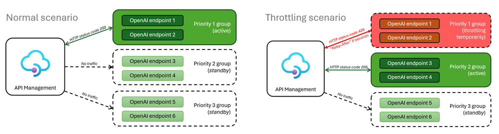

# Smart load balancing for OpenAI endpoints and Azure API Management Terraform sample code

## Introduction

This repo is designed to implement a Smart load balancing for OpenAI endpoints and Azure API Management using [Terraform](https://www.terraform.io/) code.

Please find the original article [here](https://techcommunity.microsoft.com/t5/fasttrack-for-azure/smart-load-balancing-for-openai-endpoints-and-azure-api/ba-p/3991616).

The Smart load balancing for OpenAI endpoints and Azure API Management solution
shows how to create an Azure API Management Policy to seamlessly expose a single endpoint to your applications while keeping an efficient logic to consume two or more OpenAI or any API backends based on availability, priority and token/request service limits.

## The Terraform code

This sample terraform code deploys the all of the resources needed to implement the solution, along with Azure Application Insights to monitor the API Management.

This code assumes;

- You have decided/want to have 2 priority groups for your OpenAI endpoints. Please see the original article [here](https://techcommunity.microsoft.com/t5/fasttrack-for-azure/smart-load-balancing-for-openai-endpoints-and-azure-api/ba-p/3991616) for more details around the concept of "priority groups".
- Priority group 1 has two Azure Open AI endpoints deployed into US East and US East 2 regions.
- Priority group 2 has one Azure Open AI endpoints deployed into the Canada East region.

All 3 Azure Open AI endpoints are using gpt-35-turbo with model version 0613.

### How to use

1. Clone the repo
2. Install Terraform
3. If you are using VSCode, [install the Terraform extension](https://learn.microsoft.com/en-us/azure/developer/terraform/configure-vs-code-extension-for-terraform?tabs=azure-cli)
4. Run `terraform init`
5. Run `terraform plan`
6. Run `terraform apply`

## License

MIT License

Copyright (c) [2023] [Michael Friedrich]

Permission is hereby granted, free of charge, to any person obtaining a copy
of this software and associated documentation files (the "Software"), to deal
in the Software without restriction, including without limitation the rights
to use, copy, modify, merge, publish, distribute, sublicense, and/or sell
copies of the Software, and to permit persons to whom the Software is
furnished to do so, subject to the following conditions:

The above copyright notice and this permission notice shall be included in all
copies or substantial portions of the Software.

THE SOFTWARE IS PROVIDED "AS IS", WITHOUT WARRANTY OF ANY KIND, EXPRESS OR
IMPLIED, INCLUDING BUT NOT LIMITED TO THE WARRANTIES OF MERCHANTABILITY,
FITNESS FOR A PARTICULAR PURPOSE AND NONINFRINGEMENT. IN NO EVENT SHALL THE
AUTHORS OR COPYRIGHT HOLDERS BE LIABLE FOR ANY CLAIM, DAMAGES OR OTHER
LIABILITY, WHETHER IN AN ACTION OF CONTRACT, TORT OR OTHERWISE, ARISING FROM,
OUT OF OR IN CONNECTION WITH THE SOFTWARE OR THE USE OR OTHER DEALINGS IN THE
SOFTWARE.

---

## Contact

> LinkedIn [Michael Friedrich](https://www.linkedin.com/in/1michaelfriedrich/) &nbsp;&middot;&nbsp;
> GitHub [fredderf204](https://github.com/fredderf204) &nbsp;&middot;&nbsp;
> Twitter [@fredderf204](https://twitter.com/fredderf204)
